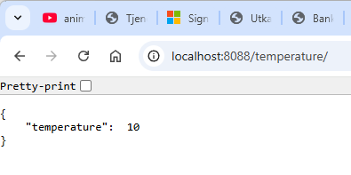
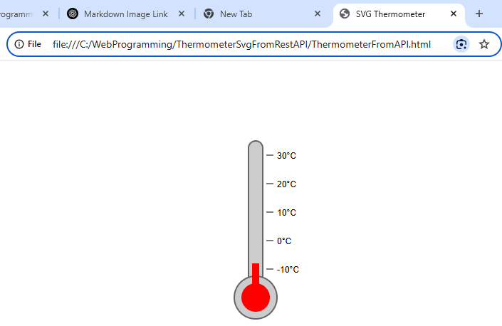
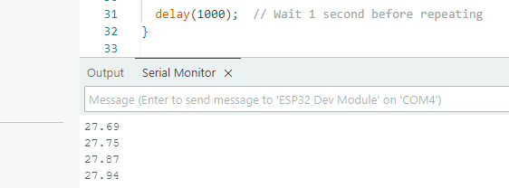
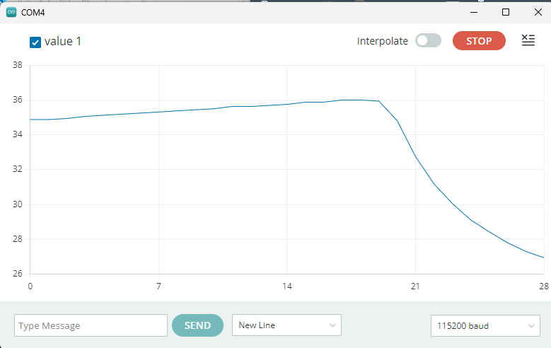
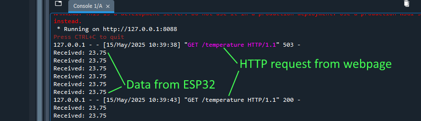
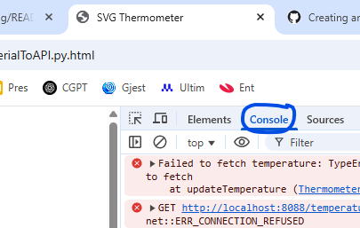

# ThermometerSvgFromRestAPI
This GitHub repository is project focused on demonstrating how to create a dynamic SVG thermometer that displays temperature data retrieved from a REST API.

## Project Overview
The repository contains a folder named ThermometerSvgFromRestAPI, which includes:

A PowerShell script: RandomTemperatureAPI.ps1 — this script runs a local API server that serves random temperature values at http://localhost:8088/temperature/.

An HTML file: ThermometerFromAPI.html — this file fetches the temperature data from the API and displays it using an SVG-based thermometer graphic.

# UserManual 
##Part1: With powershell and random temperature

1. Run API in Powershell: /ThermometerSvgFromRestAPI/RandomTemperatureAPI.ps1
2. Open the API in browser http://localhost:8088/temperature/ . It should give something like:
<br>


<br>
4. Open the html file in browser file:///C:/WebProgramming/ThermometerSvgFromRestAPI/ThermometerFromAPI.html . Itshould give something like:
<br>

 

##Part2: With python and temperature from ESP32 with DS18B20 sensor

1. Wire the ESP32 to the DS18B20. Yellow wire (data) to GPIO 4 (D4) with 4K7 pullup-resistor to 3.3V
2. Install Libraries:
 - OneWire
 - DallasTemperature

Install them via Library Manager in Arduino IDE (Tools > Manage Libraries).
3. Select ESP32 Dev Module in boards manager, and correct COM port
4. Upload and test with serial monitor. Ensure correct COM port speed

5. Edit source so that only the temperature (no text) is written to serial monitor
6. Test in Serial Plotter

7  Close Arduino IDE!
8. Run API in PYthon: /ThermometerSvgFromRestAPI/serialToAPI.py. Requires:
```
pip install flask
pip install flask-cors
```
If all works perfect (which it usually doesn't) it should look like:

9. Open the API in browser http://localhost:8088/temperature/ . It should give something like:
<br>


<br>
10. Open the html file in browser file:///C:/WebProgramming/ThermometerSvgFromRestAPI/ThermometerFromAPI.html . Itshould give something like:
<br>

 
11. Debug the webpage with Console in "More tools -> Developer Tools" in chrome
 
